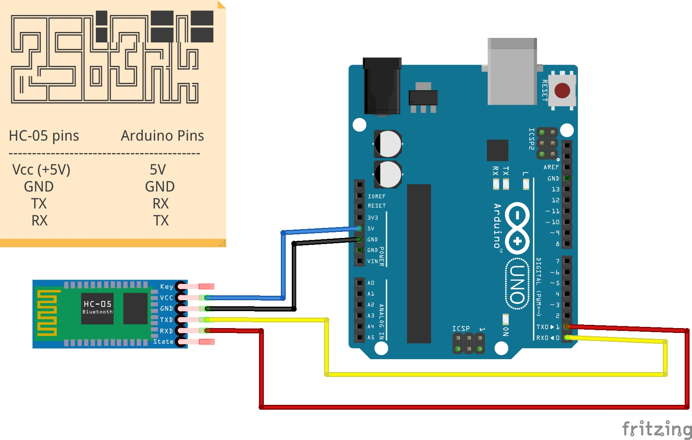

### Introduction
Here, we learn how to plug-in a Bluetooth module and communicate via our android smartphone. This is a simple application anyone can learn and also use for bigger projects.

### Items required

#### Hardware
1. Arduino UNO
2. HC-05 Bluetooth module
3. Male/Female Jumper pins

#### Software and apps
1. Arduino IDE for uploading sketch
2. [Arduino Bluetooth controller Andriod app](https://play.google.com/store/apps/details?id=com.giumig.apps.bluetoothserialmonitor&hl=en_IN)

### Working
The bluetooth module gets the characters sent via the application and passes it to the arduino board via transmitter. We read these characters and code a simple logic of turning LED on/off.

#### Bluetooth module
This module is a stand-alone module, which can connect to any hardware via bluetooth. The first time one connects we need to enter the pass key, which is `1234`. I paired the first time via the bluetooth setting in my smartphone and then accessed it via the app.

>__Note__ : 
> Do not connect the Tx and Rx on Arduino while uploading the sketch. We get an error referring to non-sync, if we try to upload the sketch while the TX, RX pins are connected.

#### Testing
Finally,  after we have uploaded the sketch successfully, we then make the necessary connections from the Bluetooth module to the Arduino board. We then run the app and connect to HC-05 module. Then we can enter the characters from the terminal tab in the app.

We can have the serial monitor open to check if we are receiving the characters correctly.

### References
You can find my Arduino projecthub site for this project here: [Blink LED via Mobile Bluetooth](https://create.arduino.cc/projecthub/csbenk/blink-led-via-mobile-bluetooth-4b8ab0)
