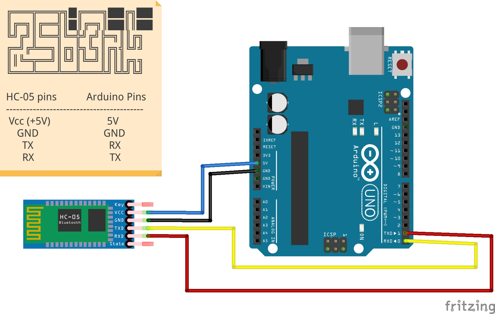

### Introduction
This is the extension of [__`bt_blink`__](../bt_blink/README.md) project. Here, I am trying to create something similar to Apple AirTags. The arduino + HC-05 module will act as AirTag, which will be addressed as `device`. Currently the `device` receives and sends data from/to the app.

### Items required

#### Hardware
1. Arduino UNO
2. HC-05 Bluetooth module
3. Male/Female Jumper pins

#### Software and apps
1. Arduino IDE for uploading sketch
2. DIY Tags App (in the making).

### Working
The bluetooth module gets the characters sent via the application and passes it to the arduino board via transmitter. We read these characters and share the ID of bluetooth, that will be stored in the Arduino. We also turn ON/OFF the LED. We will later expect app to send some bigger data instead of `1`/`2` which are being sent. We can then share the public key (ID) of the current `device`.

We can have the serial monitor open to check if we are receiving the characters correctly.
