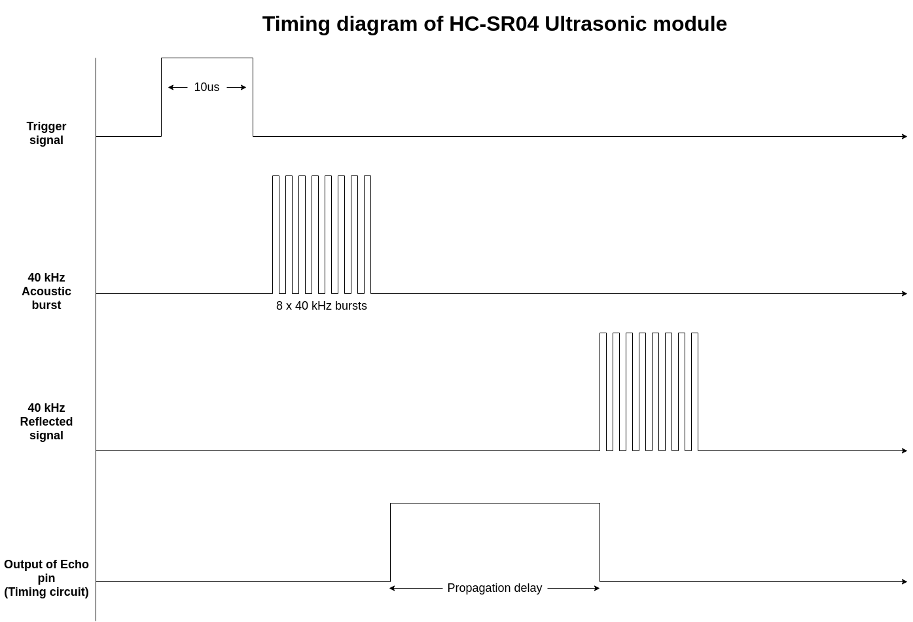
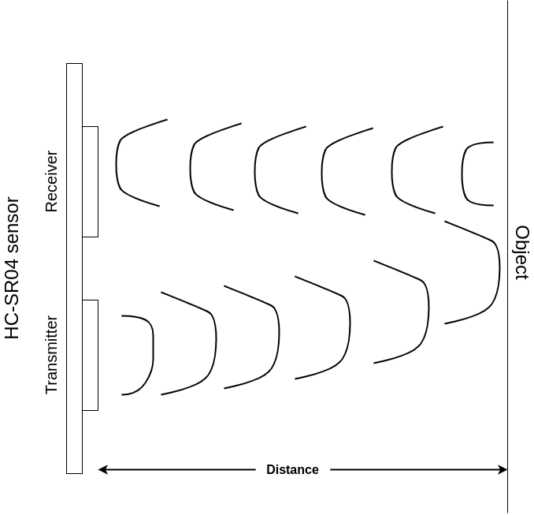

### Introduction
Here, We intend to estimate the distance of an object from the ultrasonic sensor.

### Items required

#### Hardware
1. Arduino UNO
2. HC-SR04 Ultrasonic sensor
3. Male/Female Jumper pins

#### Software and apps
1. Arduino IDE for uploading sketch

### Working

#### Ultrasonic sensor
We use HC-SR04 module in our project. The module works on principle of transmitting and receiving the ultrasonic waves which is projected towards an object. We send a 10 microseconds signal to the trig pin of the module. This triggers a burst of 40kHz (higher than hearing range) pulses from the sensor. The sensor sends eight of these pulses. After this we use pulseIn() function which calculates the duration of the pulse to return. Pulse function in our case triggers a timer which calculates the propagation delay. This is read via the echo pin. The value read is in microseconds.



We then convert the microseconds read into centimeters and print it in the serial monitor.

#### Formula


The speed of sound is approximately 340 m/s. So the distance travelled in t microseconds is :

```
v = 340 m/s
v = 340 x 100 cm/ 1000000 us
v = 0.034 cm/us
v = D / t
D = v x t
```
Since D = 2 x d (Actual distance of the object, because the wave travels to and fro from the object)
```
d = v x t / 2
d = (0.034 / 2) x t
```
Here the distance is in centimeters.

#### Testing
Finally,  after we have uploaded the sketch successfully, we then make the necessary connections as shown below.


We have the serial monitor open to check the distances in `cm`.

### References
You can find my Arduino projecthub site for this project here: [Range finder using Ultrasonic Sensor](https://create.arduino.cc/projecthub/csbenk/range-finder-using-ultrasonic-sensor-563598)
